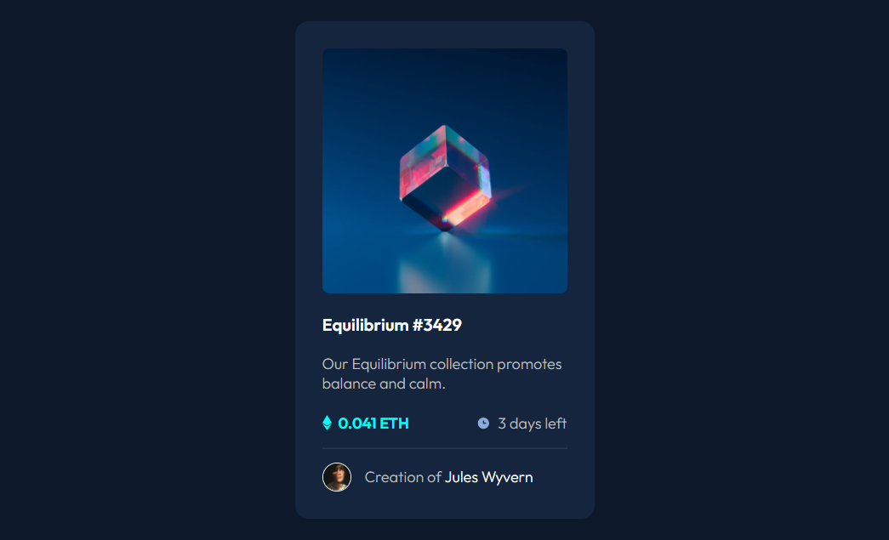

# Frontend Mentor - NFT preview card component solution

This is a solution to the [NFT preview card component challenge on Frontend Mentor](https://www.frontendmentor.io/challenges/nft-preview-card-component-SbdUL_w0U). Frontend Mentor challenges help you improve your coding skills by building realistic projects. 

## Table of contents

- [Overview](#overview)
  - [The challenge](#the-challenge)
  - [Screenshot](#screenshot)
  - [Links](#links)
- [My process](#my-process)
  - [Built with](#built-with)
  - [What I learned](#what-i-learned)
  - [Continued development](#continued-development)
  - [Useful resources](#useful-resources)
- [Author](#author)

## Overview

### The challenge

Users should be able to:

- View the optimal layout depending on their device's screen size
- See hover states for interactive elements

### Screenshot



### Links

- Solution URL: [https://github.com/v2ctor/fm-nft-preview-card-component-task](https://github.com/v2ctor/fm-nft-preview-card-component-task)
- Live Site URL: [https://v2ctor.github.io/fm-nft-preview-card-component-task/](https://v2ctor.github.io/fm-nft-preview-card-component-task/)

## My process

### Built with

- BEM methodology
- Sass/SCSS
- Flexbox
- CSS Grid

### What I learned

I learned the basics of Sass/SCSS and I especially liked the ability to split the code into modules.

```scss
@use 'variables';
```

### Continued development

I want to focus on using Sass/SCSS more frequently.

### Useful resources

- [Sass Basics](https://sass-lang.com/guide) - This helped me to learn what Sass/SCSS is. I really liked Sass because of its modular approach and the ability to do math in CSS.

## Author

- GitHub - [v2ctor](https://github.com/v2ctor)
- Frontend Mentor - [@v2ctor](https://www.frontendmentor.io/profile/v2ctor)